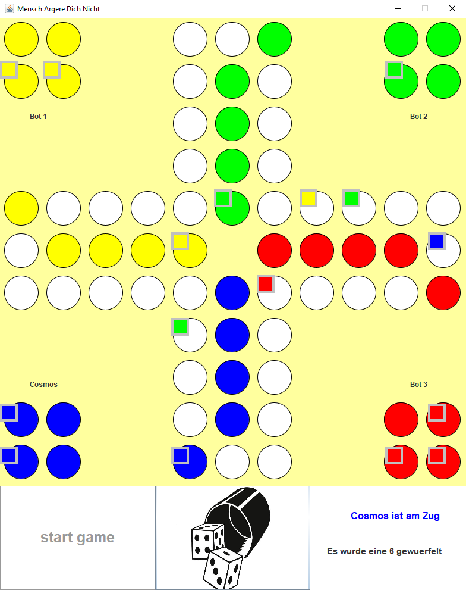
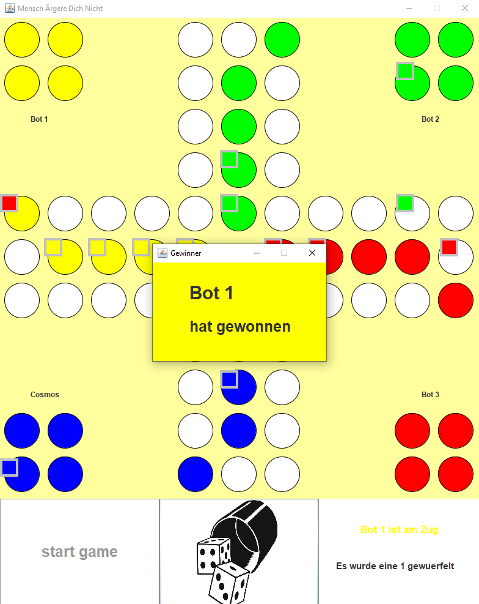

# Mensch ärgere Dich nicht – Java-Projekt

## Projektbeschreibung

Dieses Projekt simuliert das bekannte Brettspiel **"Mensch ärgere Dich nicht"** in Java und enstand in 2022 als Abschlussprojekt des Moduls "Anwendungsorientierte Programmierung" im Rahmen einer Gruppenarbeit. Das Projekt erhielt eine Bewertung von 1,7. Es können bis zu vier menschliche Spieler teilnehmen. Sind weniger als vier Spieler beteiligt, übernimmt der Computer (Bot) die restlichen Spielerplätze. Die Bots agieren mit einer einfachen, aber sinnvollen Strategie.

Das Spiel bietet eine grafische Benutzeroberfläche (GUI) und einen Testmodus, mit dem alle Spielfeatures gezielt überprüft werden können.

---

## Features

- **Bis zu 4 Spieler**: Menschliche Spieler und/oder Computergegner (Bots)
- **Intelligente Bots**: Die Computergegner wählen ihre Züge anhand einer Prioritätenstrategie aus (z.B. bevorzugt Einziehen ins Ziel, Schlagen von Gegnern, Ziehen auf sichere Felder).
- **Testmodus**: Überprüfung aller Spielfunktionen, inkl. gezielter Vorgabe von Würfelergebnissen und direktem Setzen von Figuren. Es werden u.a. folgende Fälle getestet:
  - Ziehen aus dem Haus bei einer 6 (mit und ohne Figuren auf dem Spielfeld)
  - Normales Ziehen auf dem Spielfeld
  - Schlagen von gegnerischen Figuren und illegale eigene Schläge
  - Ziehen ins sichere Zielfeld
  - Kein Zug möglich: Spieler wird übersprungen
  - Gewinnererkennung
  - Bot-Strategien: Priorisierte Auswahl von Zügen (z.B. Einziehen ins Ziel, Schlagen, Ziehen auf sichere Felder, Ziehen auf leere Felder)
- **Grafische Oberfläche**: Übersichtliches Spielfeld, Anzeige der Spieler, Würfeln per Klick
- **Sieg-Erkennung**: Automatische Feststellung des Gewinners und Anzeige
- **Flexible Spieleranzahl**: 1–4 Spieler, freie Namenswahl, Restplätze werden mit Bots aufgefüllt

---

## Projektstruktur

```
Mensch-Aerger-dich-nicht/
│
├─ images/          # für Screenshots und andere Bilder
├─ src/             # für den gesamten Java-Quellcode
│   ├─ code/
│   ├─ graphicalUserInterface/
│   └─ testmodus/
├─ README.md
├─ .gitignore
└─ ...
```

---

## Screenshots

Grafische Oberfläche des Spiels und die Gewinneranzeige:


*Das Spielfeld während des Spiels.*


*Anzeige des Gewinners nach Spielende.*

---

## Installation & Ausführung

1. **Projekt in eine Java-IDE (z.B. VS Code, Eclipse, IntelliJ) importieren**
2. **Abhängigkeiten:** Es werden keine externen Bibliotheken benötigt (nur Standard-Java).
3. **Starten:** Die Hauptklasse ist `Main.java`. Starte das Programm über diese Datei.

---

## Bedienung

- Beim Start wird nach der Anzahl der menschlichen Spieler gefragt (1–4).
- Gib die Namen der Spieler ein. Die restlichen Plätze werden automatisch mit Bots besetzt.
- Das Spiel läuft rundenbasiert ab. Jeder Spieler klickt auf das Würfelbild um zu würfeln und zieht entsprechend den Regeln.
- Die GUI zeigt das aktuelle Spielfeld, die Spieler und die gewürfelte Zahl an.
- Der Testmodus wird automatisch beim Start ausgeführt und gibt die Testergebnisse in der Konsole aus.

---

## Testmodus

Der Testmodus (`Testmodus.java`) prüft automatisch alle wichtigen Spielfunktionen, z.B.:

- Ziehen aus dem Haus bei einer 6
- Normales Ziehen auf dem Spielfeld
- Schlagen von Gegnern
- Ziehen ins Zielfeld
- Bot-Strategien

Die Ergebnisse werden in der Konsole ausgegeben.

---

## Autoren

- Max
- N.R.
- L.P.